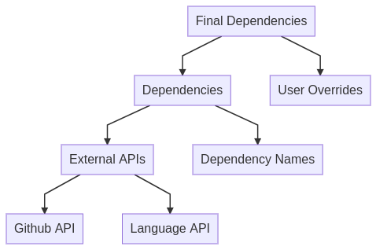

# yalich

## Installation

```
cargo install yalich
```

## Usage

`yalich` requires a configuration file which details:

- Language manifest files where dependencies are defined. Currently supported are:
  - Rust `Cargo.toml`
  - Node `package.json`
  - Python [poetry](https://github.com/python-poetry/poetry) (`pyproject.toml` files with a `tool.poetry` section)
- The user agent when making requests to public APIs. A good value is `yalich/<your_name>`

## Design

The support for licensing metadata across languages is spotty. Even withing languages with good support, packages often have a license but fail to tag it with the correct metadata.

To cover the majority of cases, `yalich` uses the following data flow:

- Get dependency ids from a language-specific manifest file
- Get metadata using an id from a language-specific API
- Follow links in metadata to more data sources


